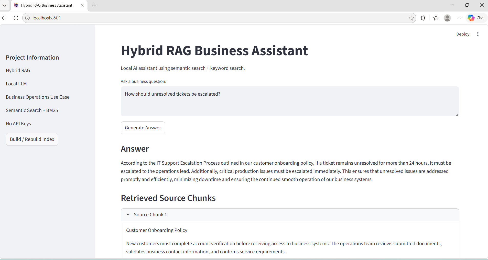

# Hybrid RAG Business Assistant

Production-style Hybrid Retrieval-Augmented Generation (RAG) platform for enterprise document intelligence using semantic retrieval, BM25 keyword search, ChromaDB, Ollama local LLMs, and Streamlit.

---

# Project Overview

This project demonstrates a local enterprise-style AI assistant capable of retrieving and analyzing operational business knowledge from uploaded documents.

The platform combines:

- semantic vector retrieval
- keyword-based retrieval
- local LLM reasoning
- dynamic document ingestion

to generate grounded operational responses from internal enterprise knowledge sources.

The system is designed for operational intelligence workflows such as:

- escalation analysis
- workflow optimization
- operational risk reviews
- onboarding policy retrieval
- process improvement analysis
- business knowledge search

---

# Key Features

## Hybrid Retrieval Architecture

Combines:

- ChromaDB semantic search
- BM25 keyword retrieval

to improve retrieval accuracy across enterprise documents.

---

## Multi-Document Ingestion

Supports simultaneous ingestion of:

- PDF documents
- DOCX documents
- TXT documents

for enterprise-style document workflows.

---

## Dynamic Indexing

Users can upload new documents and rebuild the retrieval index directly from the Streamlit interface.

---

## Local LLM Deployment

Runs locally using Ollama and Llama 3.2 without requiring external API keys.

---

## Grounded AI Responses

Retrieved source chunks are displayed before LLM response generation to support explainable and grounded retrieval workflows.

---

# System Architecture

```text
User Question
      │
      ▼
Streamlit Web Interface
      │
      ▼
Document Upload Layer
(PDF / DOCX / TXT)
      │
      ▼
Dynamic Indexing Pipeline
      │
      ▼
Hybrid Retrieval Layer
      │
 ┌───────────────┐
 ▼               ▼
Semantic      Keyword
Search        Search
ChromaDB      BM25
 │               │
 └──── Merge Results ────┐
                         ▼
                 Retrieved Context
                         ▼
                  Ollama Local LLM
                    Llama 3.2
                         ▼
                Grounded AI Response
```

---

# Screenshots

## Main Hybrid RAG Dashboard



---

# Technologies

- Python
- Streamlit
- ChromaDB
- Sentence Transformers
- Rank-BM25
- Ollama
- Llama 3.2
- PyPDF
- python-docx

---

# Applications

This platform supports enterprise operational intelligence workflows such as:

- Operational knowledge retrieval
- Incident escalation analysis
- Workflow optimization
- Operational risk assessment
- Business policy intelligence
- Enterprise document search
- Process improvement analysis
- Internal operational support systems
- Compliance and onboarding document retrieval
- Multi-document business knowledge analysis

---

# Deployment Model

- Local-first AI deployment
- Fully offline document processing
- No external API dependency
- Enterprise-style retrieval architecture
- Source-aware grounded response generation
- Streamlit-based operational dashboard

---

# Engineering Highlights

- Hybrid semantic + keyword retrieval architecture
- Local-first AI deployment using Ollama
- Multi-document enterprise search workflows
- Dynamic vector indexing pipelines
- Grounded response generation with source-aware retrieval
- PDF, DOCX, and TXT ingestion support

---

# Author

Monika Tiwari

AI Autonomous Systems Engineer | AI/ML Engineer | Enterprise RAG Systems | Local LLM Infrastructure

GitHub:
https://github.com/3mauni